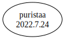

# Third Party Dependencies

<!--[[[fill sbom_sha256()]]]-->
The [SBOM in CycloneDX v1.4 JSON format](https://git.sr.ht/~sthagen/puhdistusalue/blob/default/sbom/cdx.json) with SHA256 checksum ([9f1ae24c ...](https://git.sr.ht/~sthagen/puhdistusalue/blob/default/sbom/cdx.json.sha256 "sha256:9f1ae24c5dff11d9dd52f2a18f27a39abff4837fb35c939cdf5d62244d02a840")).
<!--[[[end]]] (checksum: 4cbcce80045eecf07781193634fbec3b)-->
## Licenses 

JSON files with complete license info of: [direct dependencies](direct-dependency-licenses.json) | [all dependencies](all-dependency-licenses.json)

### Direct Dependencies

<!--[[[fill direct_dependencies_table()]]]-->
| Name                                            | Version                                                   | License     | Author       | Description (from packaging data)                                                        |
|:------------------------------------------------|:----------------------------------------------------------|:------------|:-------------|:-----------------------------------------------------------------------------------------|
| [puristaa](https://git.sr.ht/~sthagen/puristaa) | [2022.7.24](https://pypi.org/project/puristaa/2022.7.24/) | MIT License | Stefan Hagen | Puristaa (Finnish for compress) - shared prefix compression of ordered string sequences. |
<!--[[[end]]] (checksum: 927147e3b4ac1c9f2a5c5dd83802e254)-->

### Indirect Dependencies

<!--[[[fill indirect_dependencies_table()]]]-->
| Name | Version | License | Author | Description (from packaging data) |
|:-----|:--------|:--------|:-------|:----------------------------------|
<!--[[[end]]] (checksum: 8a87b89207db0be2864af66f9266660c)-->

## Dependency Tree(s)

JSON file with the complete package dependency tree info of: [the full dependency tree](package-dependency-tree.json)

### Rendered SVG

Base graphviz file in dot format: [Trees of the direct dependencies](package-dependency-tree.dot.txt)



### Console Representation

<!--[[[fill dependency_tree_console_text()]]]-->
````console
puristaa==2022.7.24
````
<!--[[[end]]] (checksum: b669455c16dd21b09b8f75cdb61608a8)-->
